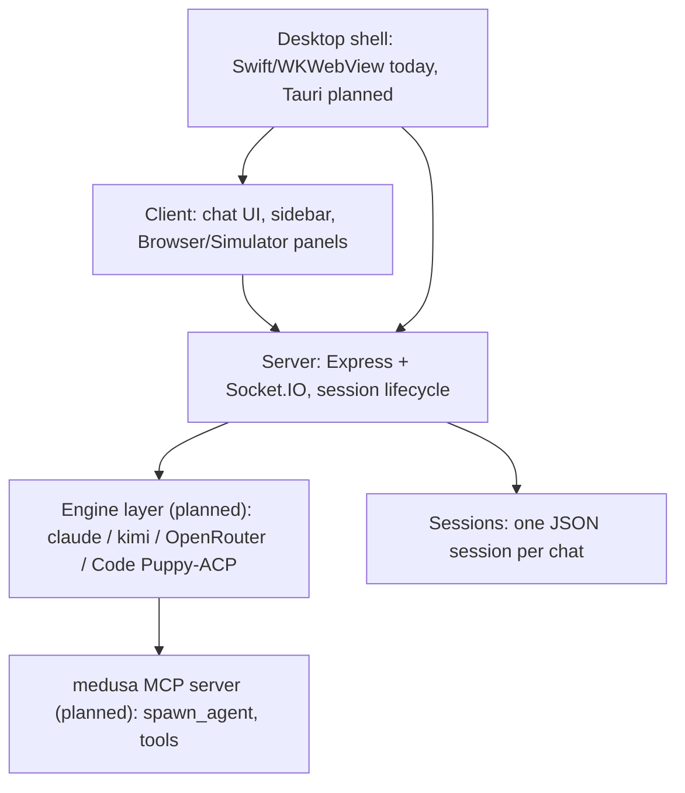

# Medusa: Project Overview

Medusa is a single-agent, model-agnostic desktop AI interface. One chat is one
session, with its own project folder, provider, model, and engine. Medusa
orchestrates any parallel work herself, through a Medusa-owned MCP server that
every supported engine receives identically, rather than the user managing a
roster of bots.

This document describes the target architecture from
`docs/2026-09-17_medusa_only_orchestrator_spec.md` and
`docs/2026-09-17_ui_and_layer_addendum.md`. The engine registry
(`server/src/engine/`: `types.ts`, `registry.ts`, `claude-cli-engine.ts`,
`kimi-cli-engine.ts`, `acp-engine.ts`, `code-puppy-engine.ts`) already ships
today. What is still being built by other in-flight workstreams (S1-S3) -
the `medusa` MCP server and the subagent lifecycle manager - does not exist
in this checkout yet; those rows are marked "planned" below with the spec
section that defines them. The multi-bot code paths they replace (Hub,
dev-control, per-bot task sync) are still present in this checkout and are
what actually runs today, pending that work landing.

## Architecture

Six layers, top to bottom:

1. **Client** (React + Vite) - the chat UI: sidebar (chat list), chat pane,
   message stream, Browser/Simulator panels, settings.
2. **Server** (Node.js + Express + Socket.IO) - session lifecycle, REST API,
   real-time streaming, file-backed storage.
3. **Desktop shell** - the packaging around the client + server for a
   standalone app. A Tauri v2 shell already ships in `desktop/` (Node
   sidecar, tray, global hotkey, screen/window/region capture pickers - see
   `desktop/README.md`); the older Swift/SwiftUI + WKWebView wrapper
   (`app/`) is legacy and is being retired once `desktop/` reaches parity.
   The spec's Tauri folder-picker work (S9) is the remaining planned piece.
4. **Engine layer** - one interface, several interchangeable brains: the
   `claude` CLI, the `kimi` CLI, OpenRouter (via the `claude` CLI harness),
   and Code Puppy (via ACP). This already ships as `server/src/engine/`
   (`types.ts`, `registry.ts`, `claude-cli-engine.ts`, `kimi-cli-engine.ts`,
   `acp-engine.ts`, `code-puppy-engine.ts`); `server/src/claude/process-manager.ts`
   resolves an engine from the registry rather than spawning Claude/Kimi
   directly.
5. **MCP tools layer** - a Medusa-owned MCP server (`medusa`), reached over
   stdio by a shim process every engine spawns identically, exposing
   `spawn_agent` / `agent_status` / `agent_result` / `list_agents` /
   `cancel_agent` plus the Browser/Simulator/file tools. *Planned, spec
   Section A* - not present in this checkout.
6. **Sessions** - one JSON-backed session per chat (`SessionMeta`): folder,
   provider, model, and (planned) engine, persisted under `~/.claude-chat/`.

## Component table

| Component | Path | Status |
|---|---|---|
| Express + Socket.IO entry point | `server/src/index.ts` | current |
| Session metadata store | `server/src/sessions/store.ts` | current; gains `engineId`/`providerId` per spec Section B.1 |
| Socket event handlers | `server/src/socket/handler.ts` | current; loses the Hub/mention branches per spec Section D.2 |
| Session process spawn/manage | `server/src/claude/process-manager.ts` | current; already resolves an `Engine` from `server/src/engine/registry.ts` rather than spawning Claude/Kimi directly |
| NDJSON stream parser | `server/src/claude/stream-parser.ts` | current, kept unchanged per spec Summary point 9 |
| Multi-account / provider settings | `server/src/settings/store.ts` | current |
| Projects pane store | `server/src/projects/store.ts` | current; rescoped to per-session per spec Section E.5 |
| Project/task sync from bot markers | `server/src/projects/task-sync.ts` | current; removed per spec Section D.1 (Medusa edits the file directly instead) |
| Hub message store | `server/src/hub/store.ts` | current; removed per spec Section D.1 |
| Mention routing | `server/src/hub/mention-router.ts` | current; removed per spec Section D.1 |
| Poll scheduler (bot heartbeats) | `server/src/hub/poll-scheduler.ts` | current; removed per spec Section D.1 |
| Dev-control (pause/resume bots) | `server/src/dev-control/` | current; removed per spec Section D.1 |
| Browser pane (CDP screencast) | `server/src/cowork/screencast.ts`, `client/src/components/Cowork/CoworkPane.tsx` | current, kept unchanged; moves to a header icon per addendum item 3 |
| Simulator pane (idb) | `server/src/cowork/simulator-stream.ts`, `client/src/components/Cowork/SimulatorPane.tsx` | current, kept unchanged; moves to a header icon per addendum item 3 |
| Token usage / metrics | `server/src/metrics/token-logger.ts` | current; `byBot` renamed `bySession`, `bySubagent` added, per spec Section A.8 |
| Sidebar | `client/src/components/Sidebar/Sidebar.tsx` | current; Hub nav item, Stop All, and per-bot status symbols removed per spec Section E.1 |
| Chat UI (formerly Hub-scoped) | `client/src/components/Hub/MedusaChat.tsx` | current; directory renamed to `client/src/components/Chat/` per spec Section D.3 |
| Session state | `client/src/stores/sessionStore.ts` | current; `pendingTasks`/`devControl` dropped per spec Section D.4 |
| Engine registry | `server/src/engine/` | current - `types.ts`, `registry.ts`, `claude-cli-engine.ts`, `kimi-cli-engine.ts`, `acp-engine.ts`, `code-puppy-engine.ts` |
| Provider registry (OpenRouter, live model listing) | `server/src/settings/providers.ts`, `server/src/routes/providers.ts` | current |
| Socket error policy (auth-error detection, dedupe) | `server/src/socket/error-policy.ts` | current |
| Desktop shell (Tauri v2, Node sidecar, tray, hotkey) | `desktop/` | current - see `desktop/README.md`; the older Swift `app/` is legacy |
| Subagent lifecycle manager | `server/src/subagents/manager.ts` | planned, spec Section A.3 |
| `medusa` MCP server + shim | `server/src/mcp/medusa-mcp-shim.ts`, `server/src/mcp/config.ts` | planned, spec Section A.3 |
| Subagent HTTP API | `server/src/routes/subagents.ts` | planned, spec Section A.3 |
| Subagent card (client) | `client/src/components/Chat/SubagentCard.tsx` | planned, spec Section A.6 |
| Subagent store (client) | `client/src/stores/subagentStore.ts` | planned, spec Section A.3 |
| Orchestrator system prompt | `server/src/sessions/orchestrator-prompt.ts` | planned, spec Section C - replaces `server/src/sessions/compact-prompts.ts` |
| Tauri folder picker | `desktop/src-tauri/` | planned, spec Section B.2/S9 - the `desktop/` shell itself already ships; only the native folder-picker dialog is outstanding |
| Redesigned left rail / right panel (Browser\|Simulator) / Activity Log | `client/src/components/` (new layout) | planned, per `docs/2026-09-17_ui_and_layer_addendum.md` - not built in this checkout |
| Voice loop client UI (S14-C) | `client/src/components/Voice/VoiceBar.tsx`, `client/src/lib/voice/`, `client/src/stores/voiceStore.ts` | current; built against the `docs/2026-09-18_s14_voice_loop_spec.md` Section 7 socket contract. Server side (S14-A voice pipeline, S14-B follow-ups) still planned |

## How it works today (pre-migration)

1. Client creates a session via `POST /api/sessions`.
2. Client connects to Socket.IO and joins the session room.
3. Client sends `message:send`; the server spawns the configured CLI process
   for that session and pipes its NDJSON stdout through `StreamParser`.
4. Parsed events stream back to the client room as `message:stream:*` events.
5. On process exit, session status transitions from busy to idle.

## Where this is headed

Per the orchestrator spec (Section F), the work is split into workstreams
S1-S12: the `medusa` MCP server and subagent manager (S1 - the engine
registry itself already shipped ahead of this workstream), the session model
and migration off the bot roster (S2), removal of the Hub/dev-control/task-
sync code (S3), this documentation pass (S4), the redesigned sidebar and chat
header (S5), the subagent card (S6), client-side removals (S7), the new
orchestrator prompt (S8), the Tauri folder picker (S9), usage attribution
(S10), the Projects pane rescope (S11), and a cross-engine subagent eval
(S12). See `Features.md` for the roadmap and `docs/2026-09-17_ui_and_layer_addendum.md`
for the target three-column layout (left rail, center chat with the model
selector under the input, right Browser|Simulator panel, and a collapsible
Activity Log) and the three-layer "Medusa layer" vision (persona/rules,
tools, engine) that this architecture is converging toward.
