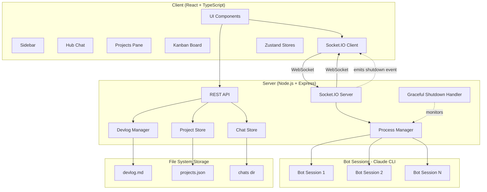
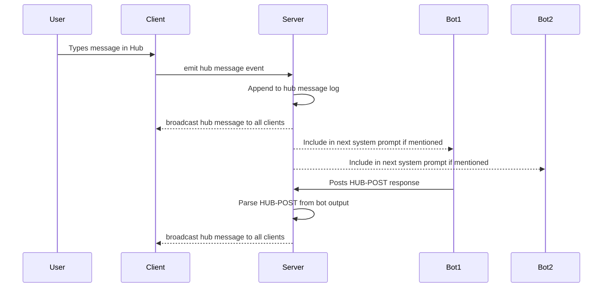
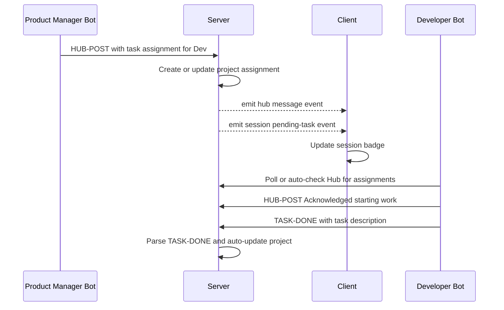
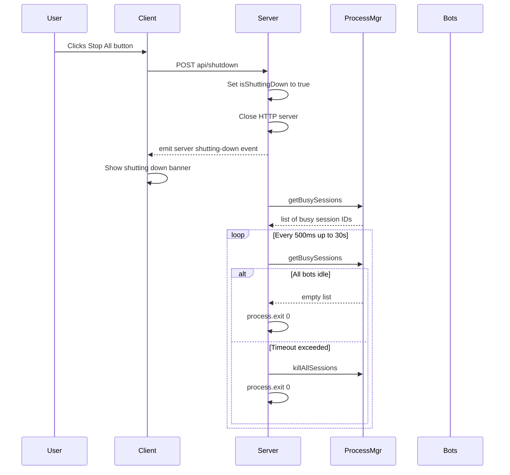
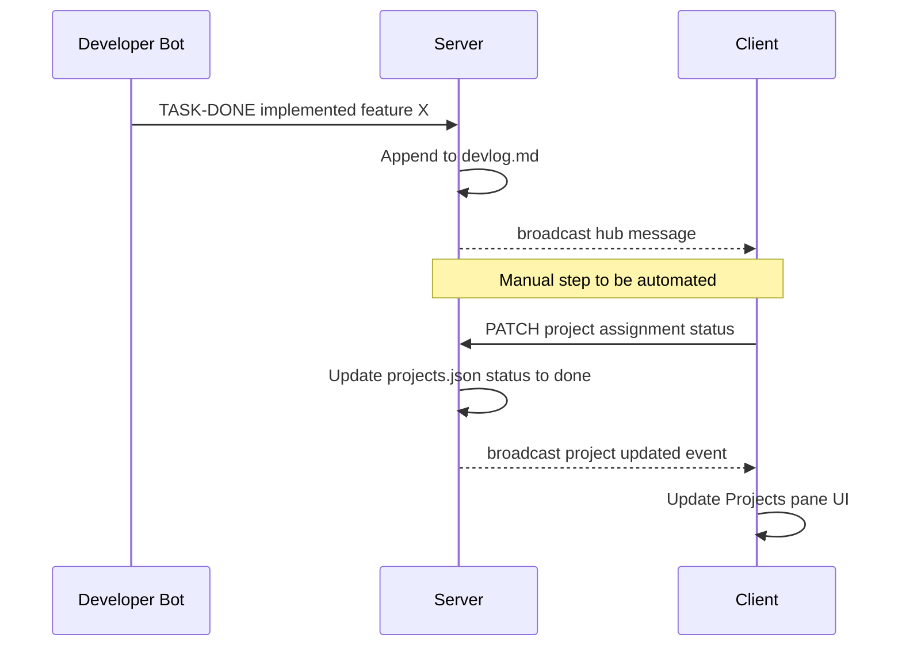

# Medusa Architecture

## System Overview

Medusa is a multi-bot orchestration system that enables parallel execution of multiple Claude AI sessions with real-time coordination via a shared Hub.

## High-Level Architecture

## Component Details

### Client Layer

**UI Components:**
- Sidebar: Bot session list, Projects pane, Hub button, Stop All button
- Hub: Shared message feed for bot-to-bot coordination
- Projects: Task tracking with priority badges (P0/P1/P2) and status indicators
- Kanban: Visual task board with drag-drop columns

**State Management (Zustand):**
- `sessionStore`: Bot sessions, status (idle/busy), pending tasks
- `projectStore`: Projects, assignments, completion tracking
- `chatStore`: Hub messages, @mention routing
- `useSocket`: Socket.IO connection management

**Socket Events (Client → Server):**
- `user:message` - Send message to bot
- `hub:message` - Post to Hub
- `session:create` - Spawn new bot session
- `session:stop` - Terminate bot session
- `task:done` - Mark task complete

**Socket Events (Server → Client):**
- `session:status` - Bot busy/idle state
- `session:pending-task` - Task assignment notification
- `hub:message` - Broadcast Hub message
- `server:shutting-down` - Graceful shutdown notification

### Server Layer

**REST API Endpoints:**
- `POST /api/sessions` - Create new bot session
- `POST /api/sessions/:id/message` - Send message to bot
- `DELETE /api/sessions/:id` - Stop bot session
- `GET /api/projects` - List all projects
- `POST /api/projects` - Create project
- `PATCH /api/projects/:id/assignments/:assignmentId` - Update assignment status
- `POST /api/shutdown` - Trigger graceful shutdown

**Process Manager:**
- Spawns Claude CLI child processes (one per bot session)
- Routes messages with `--model` parameter for tiered routing (haiku/sonnet/opus)
- Tracks busy/idle state via active process monitoring
- Returns `getBusySessions()` for graceful shutdown drain

**Project Store:**
- Manages projects.json CRUD operations
- Tracks assignments per project
- Status: pending → in_progress → done
- Priority extraction from titles (P0/P1/P2)

**Chat Store:**
- Persists Hub messages to `chats/hub.json`
- Handles @mention routing
- Supports message filtering and pagination

**Devlog Manager:**
- Appends timestamped entries to `devlog.md`
- Pagination on server startup (reduces bot context size)
- Single source of truth for all bot work logs

**Graceful Shutdown:**
- Listens for SIGTERM/SIGINT signals
- `/api/shutdown` endpoint triggers same handler
- Drain period (30s default, configurable via `GRACEFUL_SHUTDOWN_TIMEOUT_MS`)
- Waits for `getBusySessions()` to return empty array
- Force-kill if timeout exceeded
- Emits `server:shutting-down` socket event to client

### Bot Session Layer

**Claude CLI Process:**
- Spawned via `claude --resume <sessionId>` (persistent conversations)
- Optional `--model <haiku|sonnet|opus>` for tiered routing
- Output parsed as SSE stream (Server-Sent Events)
- Process lifecycle managed by ProcessManager

**Bot Accountability:**
- Auto-continuation: Bots check Hub for next assignment when idle
- Escalation: `@You 🚨🚨🚨 APPROVAL NEEDED: <description>` convention
- Stale detection: 10-minute threshold triggers warning (future work)

## Data Flow Diagrams

### Hub Message Flow

### Task Assignment Flow

### Graceful Shutdown Flow

### Project Status Update Flow (Manual — Automation Planned)

## Technical Stack

**Client:**
- React 18
- TypeScript
- Zustand (state management)
- Socket.IO Client
- Vite (dev server)
- Electron (desktop app packaging)

**Server:**
- Node.js
- Express
- Socket.IO Server
- TypeScript
- Zod (validation)

**Bots:**
- Claude CLI (Anthropic)
- SSE stream parsing
- Model tiers: haiku (fast), sonnet (balanced), opus (powerful)

**Storage:**
- File-based (JSON + Markdown)
- `projects.json` - Project/assignment data
- `chats/hub.json` - Hub message history
- `devlog.md` - Timestamped work log

## Key Design Decisions

### Why File-Based Storage?
- Simplicity: No database setup required
- Transparency: Human-readable formats (JSON, Markdown)
- Git-friendly: Version control for project history
- Sufficient scale: Designed for 5-15 concurrent bots, not 1000s

### Why Socket.IO Over REST Polling?
- Real-time updates: Hub messages, bot status changes
- Lower latency: Instant notifications for task assignments
- Bidirectional: Server can push updates without client request
- Efficient: Single persistent connection vs repeated HTTP requests

### Why Process Manager Over Threads?
- Isolation: Each bot session is independent process (crash doesn't affect others)
- Claude CLI compatibility: Designed as CLI tool, not library
- Resource limits: OS-level process management
- Debugging: Easy to inspect individual bot processes

### Why Graceful Shutdown?
- User experience: Bots finish current work before exit
- Data integrity: No mid-task corruption
- Predictability: User knows when shutdown completes
- Control: Configurable timeout for emergency force-kill

## Future Architecture Improvements

**Planned (P1):**
- **Project/Devlog Hygiene Automation**: Listen for `task:done` socket events → auto-PATCH project assignments
- **@all Mention Support**: Broadcast to all active bots in Hub
- **Send Messages to Busy Bots**: Queue messages, deliver after current operation completes

**Backlog (P2):**
- **Conversation Summarization**: Compress bot context for long-running sessions
- **Stale Assignment Detection**: Auto-escalate if bot hasn't updated in 10+ minutes
- **Desktop Notifications**: System alerts for @mentions when app in background
- **Bot Health Monitoring**: Track response times, error rates, auto-restart on crashes

## Security Considerations

- **No Authentication (Local Only)**: Medusa runs on localhost, trusted environment
- **No Secret Storage**: `.env` contains API tokens, never committed to git
- **Process Sandboxing**: Bots run in sandboxed mode by default (can be disabled with `dangerouslyDisableSandbox`)
- **CORS**: Server only accepts connections from localhost origins

## Performance Optimization

**Token Efficiency (Completed - P0):**
- Tiered model routing: haiku for simple tasks, opus for complex reasoning
- Hub message filtering: Only include @mentions in bot context
- Devlog pagination: Limit context to last N entries on startup
- Idle bot hibernation: Stop processes when not actively working
- Terse bot-to-bot communication: <50 token convention

**UI Optimization:**
- Projects pane: Max 3 visible items, scrollbar for overflow
- Lazy loading: Sessions render on-demand
- Optimistic updates: UI updates before server confirmation
