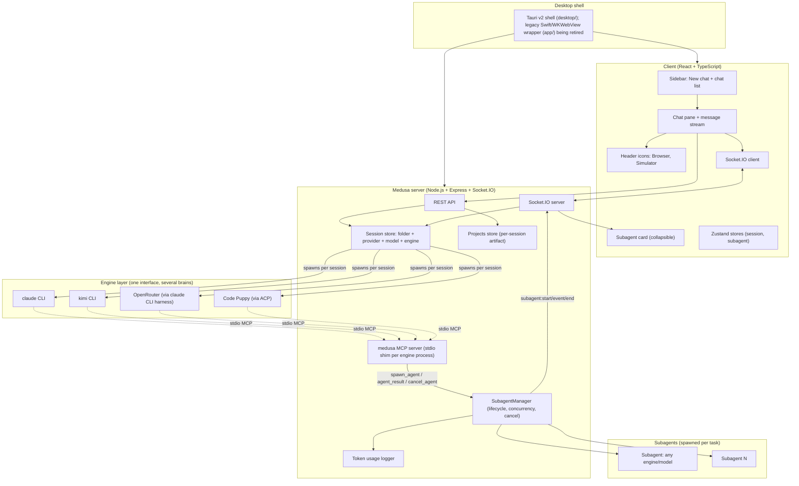
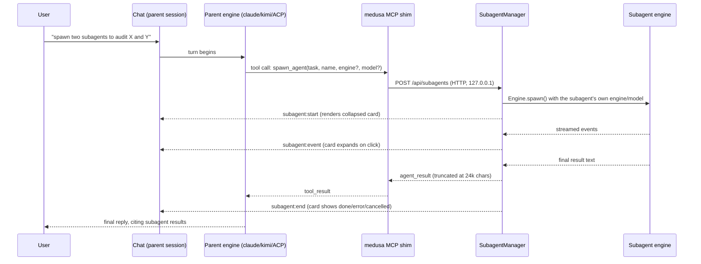

# Medusa Architecture

This diagram reflects the target, single-orchestrator architecture from
`docs/2026-09-17_medusa_only_orchestrator_spec.md` and
`docs/2026-09-17_ui_and_layer_addendum.md`, not the multi-bot Hub system
these docs replace (see `docs/archive/` for that history). The engine
registry (`server/src/engine/`) already ships; the `medusa` MCP server and
the subagent manager are still in progress (workstreams S1-S3) and are what
this checkout does not have yet, per `PROJECT_OVERVIEW.md`.

Note: the previous renderings of this diagram, `medusa_architecture.png` and
`medusa_architecture.html`, described the retired multi-bot Hub topology and
have been deleted as stale. This Mermaid source is now the only rendering;
GitHub and most Markdown viewers render it inline.

## System overview

Medusa is a single-agent, model-agnostic desktop AI interface. One chat is
one session, with its own project folder, provider, model, and engine.
Medusa orchestrates parallel work herself by spawning subagents through a
Medusa-owned MCP server (`medusa`) that every engine receives identically.

## High-level architecture

```mermaid
graph TB
    subgraph Client["Client (React + TypeScript)"]
        Sidebar["Sidebar: New chat + chat list"]
        ChatUI["Chat pane + message stream"]
        SubCard["Subagent card (collapsible)"]
        HeaderIcons["Header icons: Browser, Simulator"]
        SocketClient["Socket.IO client"]
        Zustand["Zustand stores (session, subagent)"]
    end

    subgraph Shell["Desktop shell"]
        AppShell["Tauri v2 shell (desktop/); legacy Swift/WKWebView wrapper (app/) being retired"]
    end

    subgraph Server["Medusa server (Node.js + Express + Socket.IO)"]
        API["REST API"]
        SocketServer["Socket.IO server"]
        SessionStore["Session store: folder + provider + model + engine"]
        SubagentMgr["SubagentManager (lifecycle, concurrency, cancel)"]
        MCPShim["medusa MCP server (stdio shim per engine process)"]
        Projects["Projects store (per-session artifact)"]
        TokenLogger["Token usage logger"]
    end

    subgraph Engines["Engine layer (one interface, several brains)"]
        ClaudeEngine["claude CLI"]
        KimiEngine["kimi CLI"]
        OpenRouter["OpenRouter (via claude CLI harness)"]
        CodePuppy["Code Puppy (via ACP)"]
    end

    subgraph Subagents["Subagents (spawned per task)"]
        Sub1["Subagent: any engine/model"]
        SubN["Subagent N"]
    end

    Sidebar --> ChatUI
    ChatUI --> SocketClient
    SocketClient <--> SocketServer
    ChatUI --> API
    AppShell --> Client
    AppShell --> Server

    API --> SessionStore
    API --> Projects
    SocketServer --> SessionStore

    SessionStore -->|spawns per session| ClaudeEngine
    SessionStore -->|spawns per session| KimiEngine
    SessionStore -->|spawns per session| OpenRouter
    SessionStore -->|spawns per session| CodePuppy

    ClaudeEngine -.->|stdio MCP| MCPShim
    KimiEngine -.->|stdio MCP| MCPShim
    OpenRouter -.->|stdio MCP| MCPShim
    CodePuppy -.->|stdio MCP| MCPShim

    MCPShim -->|spawn_agent / agent_result / cancel_agent| SubagentMgr
    SubagentMgr --> Sub1
    SubagentMgr --> SubN
    SubagentMgr -->|subagent:start/event/end| SocketServer
    SocketServer --> SubCard

    SubagentMgr --> TokenLogger
    ChatUI --> HeaderIcons
```

## Subagent spawn flow

```mermaid
sequenceDiagram
    participant User
    participant Chat as Chat (parent session)
    participant Engine as Parent engine (claude/kimi/ACP)
    participant Shim as medusa MCP shim
    participant Mgr as SubagentManager
    participant Sub as Subagent engine

    User->>Chat: "spawn two subagents to audit X and Y"
    Chat->>Engine: turn begins
    Engine->>Shim: tool call: spawn_agent(task, name, engine?, model?)
    Shim->>Mgr: POST /api/subagents (HTTP, 127.0.0.1)
    Mgr->>Sub: Engine.spawn() with the subagent's own engine/model
    Mgr-->>Chat: subagent:start (renders collapsed card)
    Sub-->>Mgr: streamed events
    Mgr-->>Chat: subagent:event (card expands on click)
    Sub-->>Mgr: final result text
    Mgr-->>Shim: agent_result (truncated at 24k chars)
    Shim-->>Engine: tool_result
    Mgr-->>Chat: subagent:end (card shows done/error/cancelled)
    Engine-->>User: final reply, citing subagent results
```

## Key design decisions

### Why MCP as the uniform subagent mechanism
All four engine families (`claude`, `kimi`, ACP agents including Code Puppy,
and OpenRouter models routed through the `claude` CLI) accept an external MCP
server identically. No other spawning surface is shared across all of them,
so a stdio shim speaking MCP to the parent process and HTTP to the Medusa
server is the one mechanism that works the same everywhere.

### Why the Medusa server owns subagent lifecycle
`SubagentManager` spawns a full `Engine` per subagent, so any engine or model
can be a subagent's brain regardless of which engine the parent chat is
running. This is also what makes concurrency limits, cancellation, and cost
attribution possible from one place.

### Why one chat = one session
Folder, provider, model, and engine travel together as `SessionMeta`, so
switching chats is switching projects, not switching between members of a
bot roster.

## Removed in this redesign

The Hub feed, @mention routing, poll scheduler, dev-control (pause/resume),
PM-bot task assignment, hub markers (`[HUB-POST]`, `[TASK-DONE]`,
`[BOT-TASK]`), the Arcade, and the sidebar Usage/Stop All controls are gone.
Usage and Stop All move into Settings. See `docs/archive/README.md` for the
retired design these replace, and `Features.md` for the workstream roadmap.
